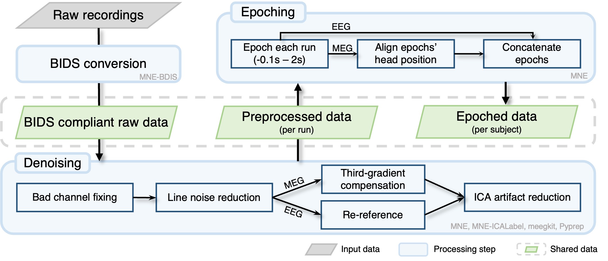

# meeg-utils

[](https://github.com/colehank/meeg-utils/actions)
[](https://colehank.github.io/meeg-utils/)
[](https://badge.fury.io/py/meeg-utils)
[](https://www.python.org/downloads/)
[](https://opensource.org/licenses/MIT)

MEG/EEG quality control, preprocessing and epoching on top of
[MNE-Python](https://mne.tools): scikit-learn style steps with documented
defaults, QC metrics and figures for every step, BIDS in and out.



```python
import meeg_utils as meu

raw = meu.io.read("bids/sub-01/eeg/sub-01_task-oddball_eeg.vhdr")
meu.qc.inspect(raw)                          # how well was it recorded?

pipe = meu.Pipeline.preset("eeg-erp")        # every parameter has a cited source
clean = pipe.fit_transform(raw)
pipe.plot(inst=raw)                          # figures of every step
```

Or a whole BIDS dataset from the command line:

```bash
meu qc bids/ --out qc/
meu run --preset eeg-erp --epochs --option "event_id=[target, standard]" \
    --sources bids/ --out bids/derivatives/meu
```

- **Acquisition QC**: bridged electrodes, flat channels, line noise, head
  movement, SQUID jumps, empty room, BIDS metadata, ...
- **Steps** for every system MNE reads: PREP, ZapLine-plus, SSS/tSSS, HFC,
  ICA with ICLabel/MEGnet, autoreject, ...
- **Presets**: `eeg-erp`, `eeg-rest`, `meg-erp`, `meg-rest`, `had-meeg`.

## Installation

```bash
pip install meeg-utils
```

## Documentation

[Tutorials, user guide and API](https://colehank.github.io/meeg-utils/) ·
[design notes](docs/design/architecture.md) (Chinese) ·
[validation on real data](docs/validation/ds007353-sub-01.md) (Chinese)

MIT License.
